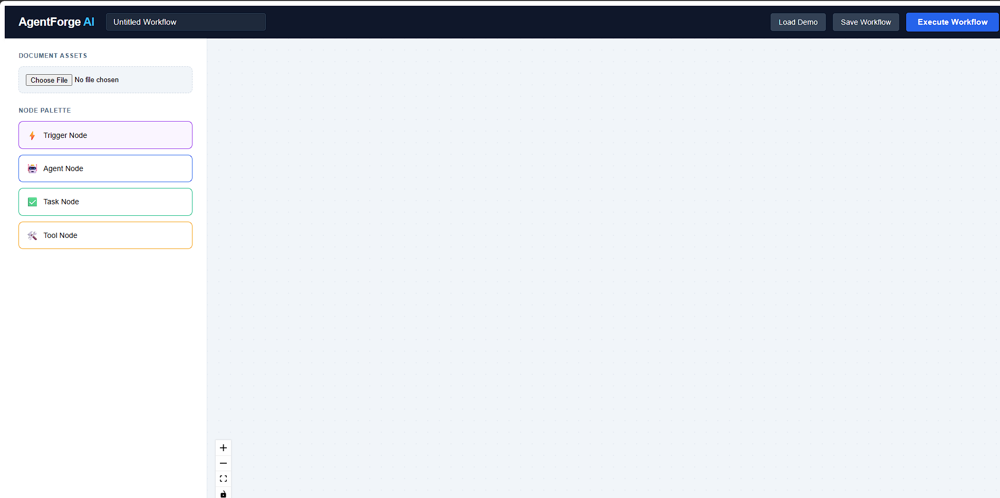
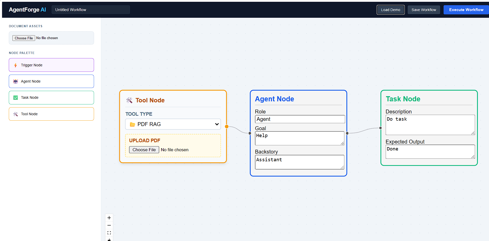

# AgentForge AI: Multi-Agent Orchestration Platform


AgentForge AI is a low-code, visual workflow builder designed for the orchestration of multi-agent systems. It provides a drag-and-drop interface for architecting autonomous agent teams, managing task assignments, and integrating specialized tools through a stateful execution engine.

---

## Interface Preview

| Visual Canvas Designer | Execution History and Logs |
| :---: | :---: |
|  |  |

---

## Core Objectives

AgentForge AI facilitates the creation of complex, non-linear agentic workflows. Unlike traditional linear automation tools, this platform supports:

*   **Event-Driven Triggers:** Activation via Webhooks or Cron-based scheduling.
*   **Autonomous Clusters:** Self-correcting agent teams capable of iterative reasoning.
*   **Conditional Logic:** Dynamic branching based on agent output and confidence scores.
*   **Human-in-the-Loop:** Manual intervention points for validation and approval.

## Technical Architecture

*   **Frontend Infrastructure:** Developed with React and React Flow for high-performance graph rendering and state management.
*   **Orchestration Backend:** Powered by FastAPI and CrewAI, utilizing a sequential and hierarchical processing model.
*   **Inference Engine:** High-speed LLM execution via the Groq API (Llama-3.1-8b-instant).
*   **Persistence Layer:** SQLAlchemy with SQLite for workflow blueprints and execution history.
*   **Vector Infrastructure:** FAISS with HuggingFace embeddings for Document RAG (Retrieval-Augmented Generation).

---

## Installation and Deployment

### 1. Prerequisites
*   Python 3.10 or higher
*   Node.js 18 or higher
*   Groq API Credentials

### 2. Backend Configuration
Navigate to the backend directory to initialize the Python environment:

```bash
cd backend
python -m venv venv
# Windows
venv\Scripts\activate
# Unix/macOS
source venv/bin/activate

pip install -r requirements.txt
cp .env.example .env
uvicorn main:app --reload
```

### 3. Frontend Configuration
Navigate to the frontend directory to initialize the React application:

```bash
cd frontend
npm install
npm run dev
```

---

## Development Roadmap

*   **Phase 2 Logic:** Implementation of dedicated Condition nodes for Boolean branching.
*   **Validation Nodes:** Human-in-the-loop approval gates for critical production workflows.
*   **Advanced Analytics:** Graphical execution browser for auditing agent logs and performance metrics.
*   **Shared Memory:** Vector-based persistence allowing agents to maintain context across disparate sessions.

---

## License
Distributed under the MIT License.
